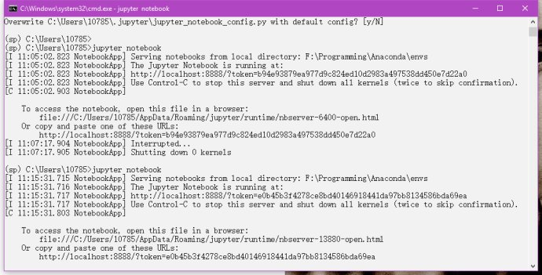
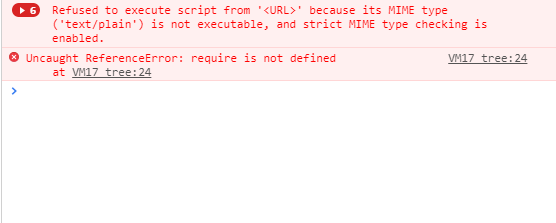
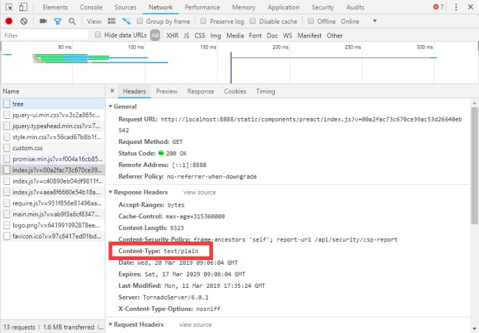
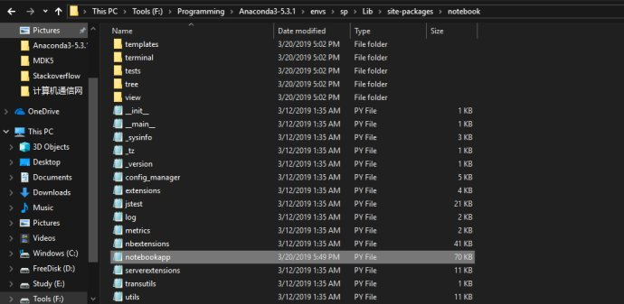
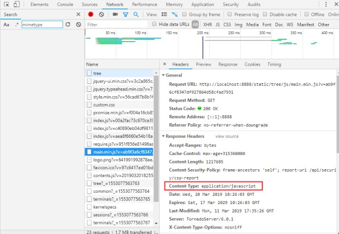

## 关于JupyterNotebook启动后页面空白的解决方案

@**capsult**


[](http://weibo.com/u/6407498606)

(2019-03-20 17:53:57)


打开Jupyter Notebook白屏，不显示任何东西，cmd也不返回任何错误，甚至在重装系统以后问题依然没有解决。



这一问题是由于Jupyter最近的一次更新造成的，下面是更新日志

```
5.7.6 ----- 5.7.6 contains a security fix for a cross-site inclusion (XSSI) vulnerability, where files at a known URL could be included in a page from an unauthorized website if the user is logged into a Jupyter server. The fix involves setting the ``X-Content-Type-Options: nosniff`` header, and applying CSRF checks previously on all non-GET API requests to GET requests to API endpoints and the /files/ endpoint. The attacking page is able to access some contents of files when using Internet Explorer through script errors, but this has not been demonstrated with other browsers. A CVE has been requested for this vulnerability.
```

**确定问题**

Jupyter Notebook 5.7.6 Webserver返回.js文件的**Content-Type**为 text/plain在strict MIME Checking下，浏览器拒绝加载Jupyter Notebook。

为了解决问题，首先确定**Content-Type**：

【博主使用Chrome浏览器】

首先在虚拟环境中打开Jupyter Notebook，发现页面空白，此时按下F12打开调试模式，发现如下所示的错误：



错误提示中，明确说明了 **MIME type is not executable, and strict MIME type checking is enabled**，此时在点击**Network**选项卡，并按下**Ctrl+F5**，列表中会多出一些文件，如下所示：


此时，任意选择一个.js文件，点击**Header**选项卡，可以找到**Content-Type**


这时我们便定位了问题所在。

**解决方案**

解决方案有两种（方案②源于GitHub [ciaranlangton](https://github.com/ciaranlangton)）

①既然Jupyter Notebook是在更新了5.7.6以后才产生的错误，此时只需要降低Jupyter Notebook的版本即可，先卸载已经安装的Jupyter Notebook：

**conda remove jupyter**

然后安装之前版本的Jupyter Notebook即可：

**conda install -c anaconda notebook==5.7.4**

②首先定位


路径：**Anaconda\env\你的环境\Lib\site-packages\notebook**

打开**notebookapp.py**

定位 **def init_mime_overrides(self):** 并将下面的所有内容替换成

​        **# mimetype for CSS and JavaScript in the registry.**

​        **# Tornado uses this when serving .css files, causing browsers to reject the stylesheet.**

​        **# We know the mimetype always needs to be text/css for css**

​        **# and application/javascript for JS, so we override it here.**

​        **mimetypes.add_type('text/css', '.css')**

​        **mimetypes.add_type('application/javascript', '.js')**

【注意空格不得有错！】

替换后保存，关闭文件，在该环境中重启Jupyter Notebook，**并在空白页面按下Ctrl+F5**，就能出现正常界面。


并且.ipynb文件也能够正常打开，如下


此时再检查Content-Type，发现已经改变

