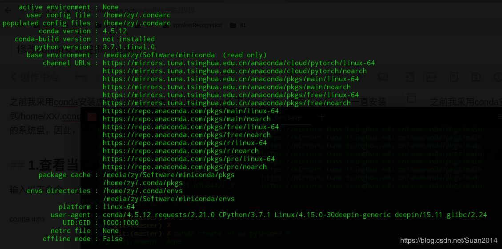

# 修改conda安装虚拟环境路径

2019-08-20 10:13:24 更多

版权声明：本文为博主原创文章，遵循[ CC 4.0 BY-SA ](http://creativecommons.org/licenses/by-sa/4.0/)版权协议，转载请附上原文出处链接和本声明。本文链接：https://blog.csdn.net/Suan2014/article/details/99821919

之前我采用conda安装虚拟环境时，都是安装到miniconda下的envs中，换了系统后，就一直安装到/home/XX/.conda/envs中，导致我编译一些项目报错，并且随着虚拟环境越来越多，会占用大量的系统盘，因此，我要将虚拟环境的默认路径给改掉。

## 1.查看当前的环境

输入以下命令

```
conda info
1
```

会出现

可以看到虚拟环境的默认路径为 ./conda

## 2. 修改config文件

从上述可以找到.condarc所在位置，输入：

```
sudo gedit /home/zy/.condarc
```

在文件中添加
envs_dirs:

​	/media/zy/Software/miniconda/envs

## 3. 附加值

修改package cache路径
pkgs_dirs:

​	/XX/XX/XX

还可以修改conda源
channels:

​	https://mirrors.tuna.tsinghua.edu.cn/anaconda/cloud/pytorch/